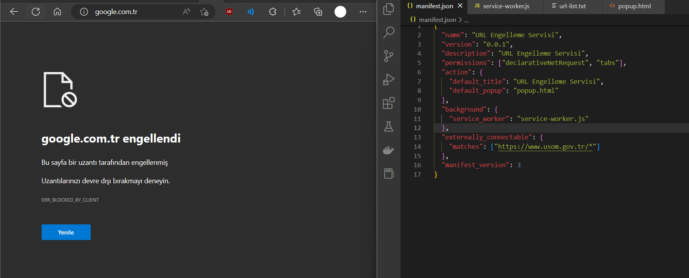

# USOM (Ulusal Siber Olaylara Müdahale Merkezi) listesi ile Chrome / Edge URL Engelleme  Chrome / Edge URL Blocker via USOM (Turkish National Cyber Incident Response Center)
  
<b>NOT : Lutfen ara sira sag ustteki butona tiklayin ve guncellemeleri kontrol edin</b>
 
<ul>
<li>Enter to <a target="_blank" href="chrome://extensions/">chrome://extensions/</a> page</li>
<li>Active developer mode</li>
<li>Load script via script folder</li>
</ul>
 

